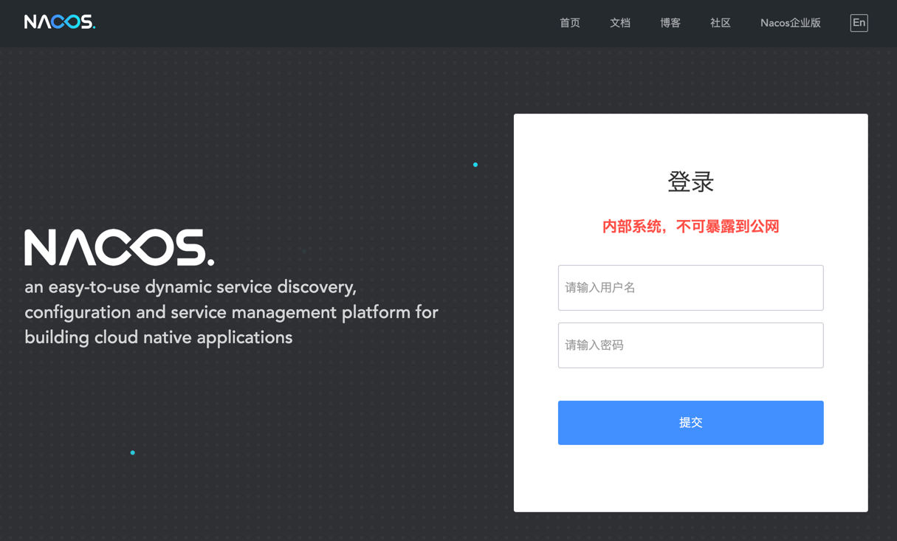
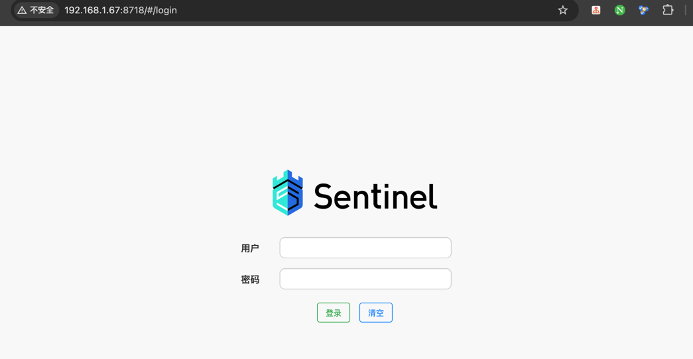

## 若依系统

> 官网: `https://doc.ruoyi.vip/ruoyi-cloud/`


### 服务治理层

#### 1. Nacos

- 安装 MySQL 5.7

```shell
wget https://repo.mysql.com//mysql57-community-release-el7-11.noarch.rpm
yum localinstall -y mysql57-community-release-el7-11.noarch.rpm
yum install mysql-community-server --nogpgcheck
systemctl  enable mysqld --now
grep -i password /var/log/mysqld.log 
2025-05-18T16:03:34.257629Z 1 [Note] A temporary password is generated for root@localhost: 6t9By=/7lqsF
mysql -uroot -p'6t9By=/7lqsF'
mysql> set global validate_password_policy=0;
mysql> alter user root@'localhost' identified by 'admin123456';
```

- 安装 Nacos

```shell
yum install  -y java-1.8.0-openjdk
wget http://repos.fedorapeople.org/repos/dchen/apache-maven/epel-7/x86_64/apache-maven-3.5.2-1.el7.noarch.rpm --no-check-certificate
yum install -y apache-maven-3.5.2-1.el7.noarch.rpm

wget https://ghfast.top/https://github.com/alibaba/nacos/releases/download/2.1.1/nacos-server-2.1.1.tar.gz
mkdir -pv  /data/apps
tar -xf nacos-server-2.1.1.tar.gz  -C /data/apps/
cd /data/apps/nacos/
vim conf/application.properties
server.servlet.contextPath=/nacos
server.error.include-message=ON_PARAM
server.port=8848
spring.datasource.platform=mysql
db.num=1
db.url.0=jdbc:mysql://127.0.0.1:3306/nacos?characterEncoding=utf8&connectTimeout=1000&socketTimeout=3000&autoReconnect=true&useUnicode=true&useSSL=false&serverTimezone=UTC
db.user.0=root
db.password.0=admin123456
db.pool.config.connectionTimeout=30000
db.pool.config.validationTimeout=10000
db.pool.config.maximumPoolSize=20
db.pool.config.minimumIdle=2
nacos.naming.empty-service.auto-clean=true
nacos.naming.empty-service.clean.initial-delay-ms=50000
nacos.naming.empty-service.clean.period-time-ms=30000
management.metrics.export.elastic.enabled=false
management.metrics.export.influx.enabled=false
server.tomcat.accesslog.enabled=true
server.tomcat.accesslog.pattern=%h %l %u %t "%r" %s %b %D %{User-Agent}i %{Request-Source}i
server.tomcat.basedir=file:.
nacos.security.ignore.urls=/,/error,/**/*.css,/**/*.js,/**/*.html,/**/*.map,/**/*.svg,/**/*.png,/**/*.ico,/console-ui/public/**,/v1/auth/**,/v1/console/health/**,/actuator/**,/v1/console/server/**
nacos.core.auth.system.type=nacos
nacos.core.auth.enabled=false
nacos.core.auth.caching.enabled=true
nacos.core.auth.enable.userAgentAuthWhite=false
nacos.core.auth.server.identity.key=serverIdentity
nacos.core.auth.server.identity.value=security
nacos.core.auth.plugin.nacos.token.expire.seconds=18000
nacos.core.auth.plugin.nacos.token.secret.key=SecretKey012345678901234567890123456789012345678901234567890123456789
nacos.istio.mcp.server.enabled=false

mysql -uroot -p'admin123456' -e "create database nacos default charset utf8mb4;"
mysql -uroot -p'admin123456' nacos < conf/nacos-mysql.sql 
 mysql -uroot -p'admin123456' -e "show tables from nacos;"
mysql: [Warning] Using a password on the command line interface can be insecure.
+----------------------+
| Tables_in_nacos      |
+----------------------+
| config_info          |
| config_info_aggr     |
| config_info_beta     |
| config_info_tag      |
| config_tags_relation |
| group_capacity       |
| his_config_info      |
| permissions          |
| roles                |
| tenant_capacity      |
| tenant_info          |
| users                |
+----------------------+
 ./bin/startup.sh  -m standalone
```
访问ui: `http://192.168.1.67:8848/nacos/`, 默认用户名密码为 nacos/nacos



#### 2. Sentinel

```shell
wget https://ghfast.top/https://github.com/alibaba/Sentinel/releases/download/1.8.5/sentinel-dashboard-1.8.5.jar
mkdir -pv /data/apps/sentinel
mv sentinel-dashboard-1.8.5.jar  /data/apps/sentinel
chown dengyouf.dengyouf  -R /data/apps/sentinel
yum install -y supervisor
systemctl  enable supervisord --now
cat > /etc/supervisord.d/sentinel.ini << 'EOF'
[program:sentinel]
directory=/data/apps/sentinel
command=/usr/bin/java  -Dserver.port=8718 -Dcsp.sentineldashboard.server=localhost:8718 -Dproject.name=sentinel-dashboard  -Dcsp.sentinel.api.port=8719 -jar sentinel-dashboard-1.8.5.jar 
user=dengyouf
autostart=true
autorestart=unexpected
startsecs=15
exitcodes=2
startretries=3
environment=
EOF
supervisorctl  status
sentinel                         RUNNING   pid 12710, uptime 0:00:47
```
访问ui: `http://192.168.1.67:8718`, 默认用户名密码为 sentinel/sentinel


#### 3. Skywalking


### 微服务层


