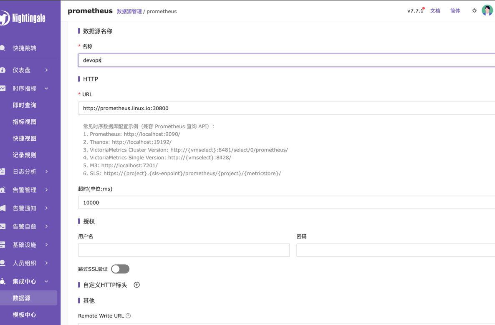
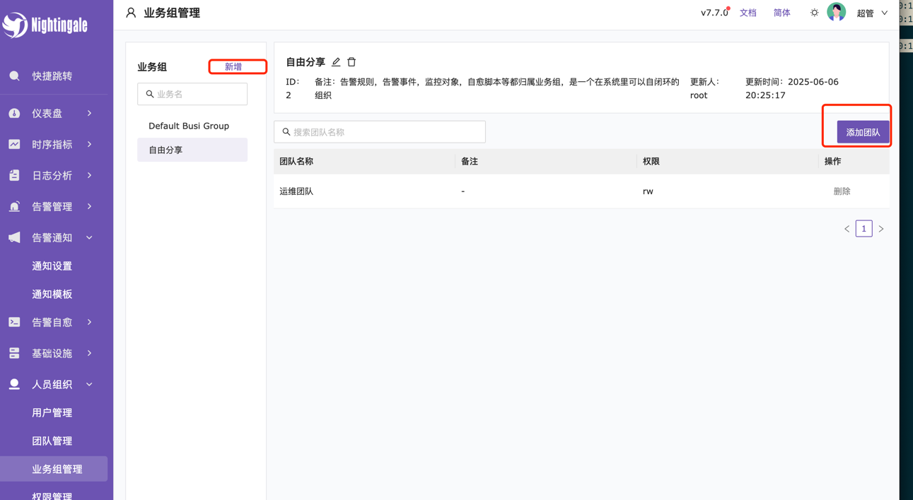
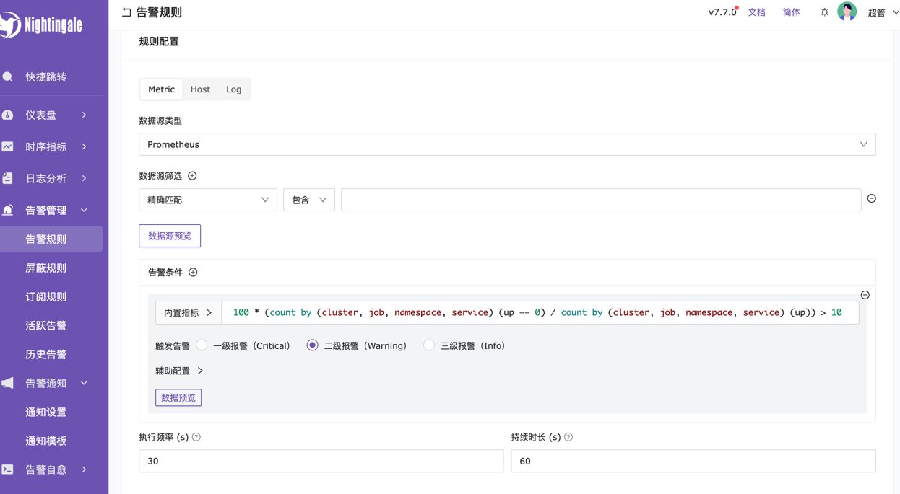
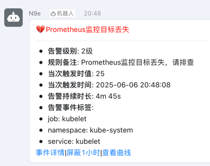

# 快速部署Prometheus监控系统

## Prometheus Server

### 1.下载prometheus

```shell
# wget https://github.com/prometheus/prometheus/releases/download/v2.47.0/prometheus-2.47.0.linux-amd64.tar.gz
wget https://ghfast.top/https://github.com/prometheus/prometheus/releases/download/v2.47.0/prometheus-2.47.0.linux-amd64.tar.gz
tar -xf prometheus-2.47.0.linux-amd64.tar.gz 
 cd prometheus-2.47.0.linux-amd64
```

### 2. 创建相关用户和目录

```shell
mkdir -p /etc/prometheus /var/lib/prometheus
useradd --no-create-home --shell /bin/false prometheus
cp prometheus promtool /usr/local/bin/
cp -r consoles console_libraries /etc/prometheus
cp prometheus.yml /etc/prometheus
chown -R prometheus:prometheus /etc/prometheus /var/lib/prometheus
```

### 3. 配置 Prometheus

```shell
vim /etc/prometheus/prometheus.yml

global:
  scrape_interval: 15s # Set the scrape interval to every 15 seconds. Default is every 1 minute.
  evaluation_interval: 15s # Evaluate rules every 15 seconds. The default is every 1 minute.
  # scrape_timeout is set to the global default (10s).

# Alertmanager configuration
alerting:
  alertmanagers:
    - static_configs:
        - targets:
          # - alertmanager:9093

# Load rules once and periodically evaluate them according to the global 'evaluation_interval'.
rule_files:
  # - "first_rules.yml"
  # - "second_rules.yml"

# A scrape configuration containing exactly one endpoint to scrape:
# Here it's Prometheus itself.
scrape_configs:
  # The job name is added as a label `job=<job_name>` to any timeseries scraped from this config.
  - job_name: "prometheus"

    # metrics_path defaults to '/metrics'
    # scheme defaults to 'http'.

    static_configs:
      - targets: ["localhost:9090"]
```

### 4. 创建系统服务文件

为了方便管理 Prometheus 服务的启动、停止和重启，可以创建一个系统服务文件。

```shell
cat > /etc/systemd/system/prometheus.service << 'EOF'
[Unit]
Description=Prometheus
Wants=network-online.target
After=network-online.target

[Service]
User=prometheus
Group=prometheus
Type=simple
ExecStart=/usr/local/bin/prometheus \
    --config.file /etc/prometheus/prometheus.yml \
    --storage.tsdb.path /var/lib/prometheus/ \
    --web.console.templates=/etc/prometheus/consoles \
    --web.console.libraries=/etc/prometheus/console_libraries \
    --web.enable-lifecycle \
    --storage.tsdb.retention.time=180d

[Install]
WantedBy=multi-user.target
EOF
```
### 5. 启动服务

```shell
systemctl  daemon-reload && systemctl  enable prometheus --now
 ss -tnlp|grep 9090
LISTEN     0      128       [::]:9090                  [::]:*                   users:(("prometheus",pid=15231,fd=7))
```

### 6. 添加到Prometheus监控

```shell title="prometheus.yml"
...
scrape_configs:
  ...
  - job_name: "promehtues-node01"
    static_configs:
      - targets: ["192.168.1.68:9100"]
  - job_name: "promehtues-node02"
    static_configs:
      - targets: ["192.168.1.69:9100"]                                   
```
```shell
curl -X POST 127.0.0.1:9090/-/reload
```

## Node Exporter

### 1. 下载 Node Exporter

```shell
#wget https://github.com/prometheus/node_exporter/releases/download/v1.6.1/node_exporter-1.6.1.linux-amd64.tar.gz
wget https://ghfast.top/https://github.com/prometheus/node_exporter/releases/download/v1.6.1/node_exporter-1.6.1.linux-amd64.tar.gz
tar -xzf node_exporter-1.6.1.linux-amd64.tar.gz
cd node_exporter-1.6.1.linux-amd64
```

### 2. 创建用户

为安全起见，创建一个专门的用户来运行 Node Exporter

```shell
useradd --no-create-home --shell /bin/false node_exporter
cp node_exporter /usr/local/bin
chown node_exporter:node_exporter /usr/local/bin/node_exporter
```

### 3.  创建系统服务

```shell
cat > /etc/systemd/system/node_exporter.service << 'EOF'
[Unit]
Description=Node Exporter
Wants=network-online.target
After=network-online.target

[Service]
User=node_exporter
Group=node_exporter
Type=simple
ExecStart=/usr/local/bin/node_exporter

[Install]
WantedBy=multi-user.target
EOF

```
### 4. 启动服务

```shell
systemctl daemon-reload && systemctl enable node_exporter --now
ss -tnlp|grep 9100
LISTEN     0      128       [::]:9100                  [::]:*                   users:(("node_exporter",pid=12535,fd=3))
```
## Grafana

```shell
yum install -y https://dl.grafana.com/oss/release/grafana-11.6.1-1.x86_64.rpm
systemctl  enable  grafana-server.service --now
```

## 夜莺监控

安装 redis 和 mariadb

```shell
yum install -y   redis mariadb-server
systemctl  enable redis mariadb --now
```

获取并解压n9e

```shell
curl -H'Referer: https://console.flashcat.cloud' -O https://download.flashcat.cloud/n9e-v7.7.0-linux-amd64.tar.gz
mkdir /data/apps/n9eapp
tar -xf n9e-v7.7.0-linux-amd64.tar.gz  -C /data/apps/n9eapp
```

初始化数据库

```shell
mysql -uroot  -e "grant all on *.* to 'n9e'@'%' identified by 'Passw0rd';"
mysql -u ne9 -p'Passw0rd' < /data/apps/n9eapp/n9e.sql
 mysql -u ne9 -p'Passw0rd' -e "show databases;"
+--------------------+
| Database           |
+--------------------+
| information_schema |
| mysql              |
| n9e_v6             |
| performance_schema |
+--------------------+
```

启动服务

```shell
cd /data/apps/n9eapp && vim etc/config.toml|
[DB]
DSN = "root:Passw0rd@tcp(192.168.1.101:3306)/n9e_v6?charset=utf8mb4&parseTime=True&loc=Local&allowNativePasswords=true"
[Redis]
Address = "192.168.1.101:6379"
```
```shell
cat > /usr/lib/systemd/system/n9e.service <<EOF
[Unit]
Description=Nightinagle

[Service]
WorkingDirectory=/data/apps/n9eapp
ExecStart=/data/apps/n9eapp/n9e

[Install]
WantedBy=multi-user.target
EOF
systemctl  start n9e
[root@k8s-master01 n9eapp]# ss -tnlp|grep 17000
LISTEN 0      32768              *:17000            *:*    users:(("n9e",pid=24538,fd=11))
```

访问 UI, 默认密码为 root/root.2020


### 配置钉钉告警

1. 添加 Prometheus数据源



2. 创建用户,在用户联系方式添加钉钉机器人


3. 创建团队，并将用户添加到团队


4. 创建业务组，并将团对添加到业务组



5. 添加告警规则
- 定义规则名称


- 配置规则



- 生效配置


- 通知配置


- 查看告警




